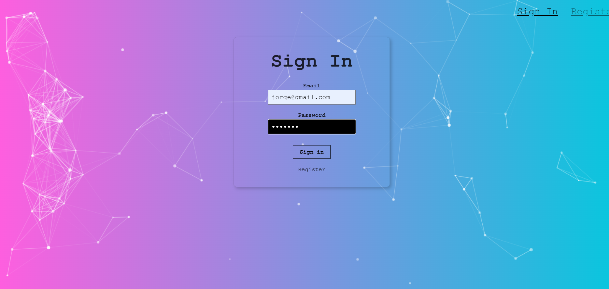
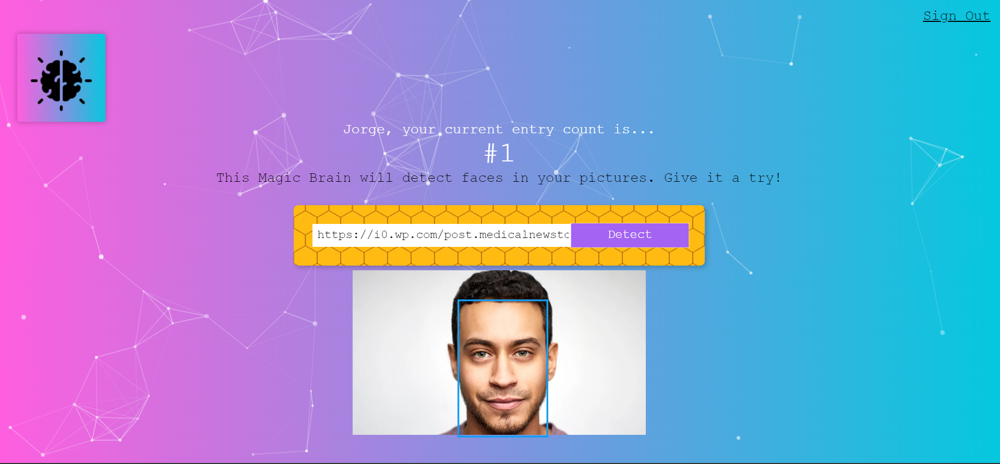

# Face-Recognition Application.

A Fullstack PERN app that recognizes faces on images uploaded by the user.

## Table of contents

  - [Overview](#overview)
  - [The project - Features](#the-project)
  - [Screenshot](#screenshot)
  - [Links](#links)
  - [My process](#my-process)
  - [Built with](#built-with)
  - [What I learned](#what-i-learned)
  - [If I had more time I would change this](#if-i-had-more-time-i-would-change-this)
  - [Continued development](#continued-development)
  - [Author](#author)

## Overview

### The project

Users should be able to:

- Recognize a face on the image URL you input.
- Register your own user safely, with passwords hashed.
- Sign in and sign out from your created profile.
- Enjoy Form validation.
- See how many entries (image URLs) you have inputed so far.
- View the optimal layout depending on their device's screen size.
- See hover states for interactive elements.

### Screenshot

### Links

- Live Site URL: [Face Recognition App Live](https://smartbrain-edxx.onrender.com/)

## My process

### Built with

- [React](https://reactjs.org/) - JavaScript library
- [Create React App](https://create-react-app.dev/) - React environment
- [Clarifai face-detection API](https://clarifai.com/clarifai/main/models/face-detection) - gRPC face-recognition API
- [Tachyons](http://tachyons.io/) - CSS Framework
- [Node.js](https://nodejs.org/en) - Server-side language
- [Express.js](https://expressjs.com/) - Node.js framework
- [PostgreSQL](https://www.postgresql.org/) - Relational Database System
- [Knex.js](https://knexjs.org/) - SQL query builder
- [JavaScript](https://developer.mozilla.org/en-US/docs/Web/JavaScript) - Frontend language
- [CSS3](https://www.w3.org/Style/CSS/) - For style
- [Semantic HTML5 markup](https://www.w3.org/html/) - For the web structure
- [particles-bg](https://www.npmjs.com/package/particles-bg) - Particle animation library
- [BcryptJS](https://www.npmjs.com/package/bcryptjs) - Password hashing library

### What I learned

- 

### If I had more time I would change this

- 

### Continued development

## Author

- Twitter - [@CokoEche](https://twitter.com/CokoEche)
- LinkedIn - [@jorgeecheverria-dev] (https://www.linkedin.com/in/jorgeecheverria-dev/)
